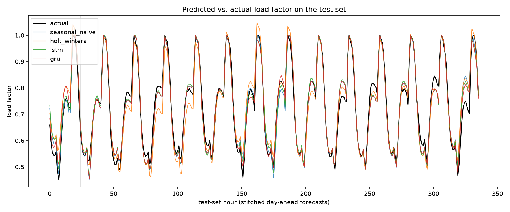
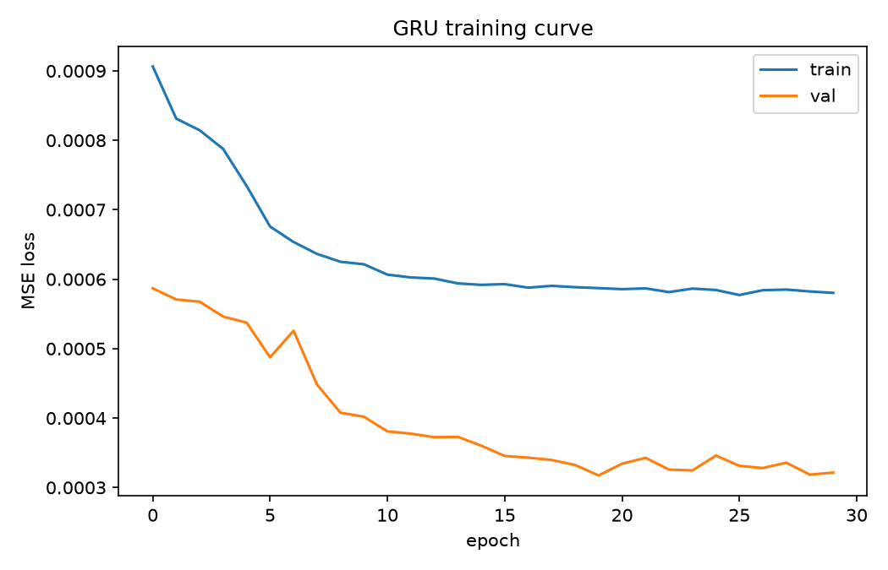
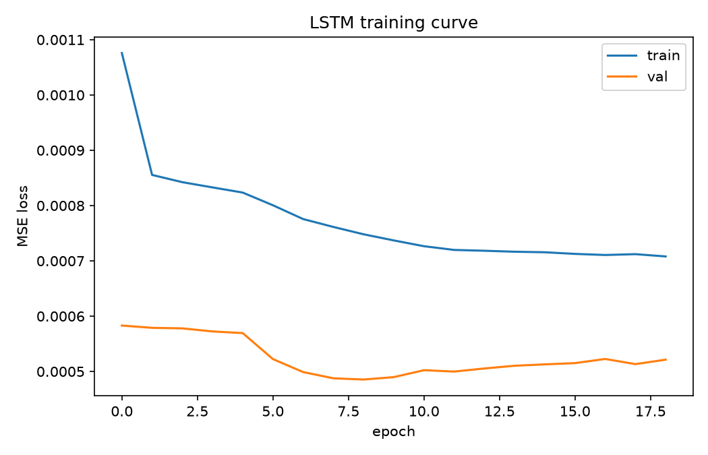

# Hourly Load Factor Forecasting

Day-ahead forecasting of electricity **load factor** (how close each hour's
demand is to that day's peak) using LSTM/GRU sequence models in PyTorch,
benchmarked against seasonal-naive and Holt-Winters exponential smoothing
baselines on real grid-load data.

**Result: a GRU forecaster cuts test-set RMSE by 18.9% versus a
seasonal-naive baseline** (0.0218 vs. 0.0269); an LSTM of similar size
improves it by 5.9%. Both beat a classical Holt-Winters baseline outright.

| Model               |     RMSE |      MAE | MAPE (%) | vs. seasonal-naive |
|---------------------|---------:|---------:|---------:|--------------------:|
| Seasonal-naive       |   0.0269 |   0.0188 |     2.81 |                +0.0% |
| Holt-Winters (ETS)   |   0.0367 |   0.0280 |     4.15 |               -36.4% |
| LSTM                 |   0.0253 |   0.0182 |     2.72 |                +5.9% |
| **GRU**              | **0.0218** | **0.0158** | **2.33** |          **+18.9%** |



## Problem statement

**Load factor** measures how close a given hour's electricity consumption
is to that day's peak:

```
LF(d, h) = P_bar(d, h) / max_h' P_bar(d, h')
```

where `P_bar(d, h)` is city-wide average power in hour `h` of day `d`. It
is bounded in `[0, 1]`: `1.0` marks the daily peak hour, low values mark
the overnight trough. Utilities use it for demand-response planning and
grid-capacity sizing — knowing tomorrow's hourly profile in advance is
directly actionable.

This project frames it as a **day-ahead forecasting task**: given the
previous 7 days (168 hours) of load factor and calendar signal, predict
all 24 hourly load-factor values for the next day, and show that a
recurrent neural network beats both a naive persistence forecast and a
classical statistical model on held-out data.

## Data

**Source:** [Power Consumption of Tetouan City](https://archive.ics.uci.edu/dataset/849/power+consumption+of+tetouan+city)
(UCI Machine Learning Repository) — 10-minute-resolution power draw across
three distribution zones of Tetouan, Morocco, for all of 2017 (364 days,
52,416 rows, no missing values). `scripts/download_data.py` fetches it.

The three zones are summed to a city-wide total, averaged into hourly
buckets, and converted to load factor per the definition above
(`src/lf_forecast/data_prep.py`), giving a **fully continuous 8,736-hour
series** (364 days x 24h).

### Why not the originally-provided CSV directly

This repo started from a 2,000-row CSV (`data/reference/hourly_load_factor_subsample.csv`)
produced for an earlier Bayesian-statistics course project on the same
underlying data. A data audit (`scripts/audit_data.py`) showed it is a
**random subsample of `(date, hour)` cells, not a time series**:

- 0 of 362 dates have all 24 hours present (mean 5.5 hours/date sampled)
- sorting by timestamp, only 23% of consecutive row-pairs are actually 1
  hour apart

That structure is useful for the cross-sectional regression the earlier
project needed, but it cannot support windowed sequence forecasting -
there is no date with a complete profile to slide a window over, let
alone several consecutive days. This project instead rebuilds the full
continuous series from the original public source so real sequential
modeling is possible, while keeping the original file in the repo as a
documented reference point.

### Confirmed structure

Reconstructed hourly means match the subsample's own hourly means almost
exactly (e.g. hour 6: 0.510 vs. 0.509; hour 20: 0.992 vs. 0.993),
confirming the reconstruction is faithful to the same phenomenon. The
load factor follows a clean single daily cycle: trough around hour 6
(~0.51, pre-dawn), rising through the morning, and peaking around hour 20
(~0.99, evening).

## Methodology

1. **Data audit** — chronological continuity, gaps, missing values, range,
   and hour-of-day cyclicality (`scripts/audit_data.py`).
2. **Feature engineering** (`src/lf_forecast/features.py`) — cyclical
   sin/cos encoding of hour-of-day and day-of-week, plus the raw
   load-factor lag itself, packaged into sliding windows of 168 input
   hours -> 24 target hours.
3. **Time-respecting split** — chronological 70/15/15 train/val/test split
   by date, no shuffling across time. Training windows are dense
   (stride=1, for more training signal); validation and test windows are
   **non-overlapping** (one independent day-ahead forecast per day), so
   reported metrics reflect independent forecasts rather than
   heavily-autocorrelated overlapping ones, and so the classical baseline
   only needs one fit per day instead of one per hour.
4. **Baselines** (`src/lf_forecast/baselines.py`):
   - *Seasonal-naive*: forecast day `d+1` hour `h` = actual value at day
     `d` hour `h`. No fitting required.
   - *Holt-Winters exponential smoothing* (additive, 24h seasonal period),
     refit independently on each window's own 168-hour history.
5. **Deep learning models** (`src/lf_forecast/models.py`) — see
   [Architecture](#architecture--hyperparameters) below.
6. **Evaluation** (`src/lf_forecast/metrics.py`) — RMSE, MAE, MAPE on the
   test set, all four models evaluated on the exact same windows.
7. **Plots** — training/validation loss curves per model, and predicted
   vs. actual load factor stitched across the test period.

## Architecture & hyperparameters

Both models share one design: an RNN encoder reads the 168-hour input
window; its final hidden state is projected through a small MLP head to a
24-length output.

**Residual-over-seasonal-naive.** An earlier version predicted the 24
target values directly from scratch (sigmoid output head) and *lost* to
seasonal-naive (RMSE 0.047 vs. 0.027) — the daily cycle here is regular
enough that "tomorrow looks like today" is a genuinely hard baseline, and
an unconstrained network wastes capacity re-deriving a shape it could
just read off its own input. The final architecture instead has the head
predict a bounded **correction** (`tanh` x scale) added to the
seasonal-naive reference — the load-factor values from exactly 24 hours
back, which are already inside the model's own input window — then clamps
to `[0, 1]`. This lets the network spend its capacity on the part
seasonal-naive gets wrong (day-to-day deviation from the previous day's
profile) instead of the part it already gets right (the daily shape
itself), and is what allows both RNNs to beat seasonal-naive on this
signal.

| Hyperparameter        | Value                     |
|------------------------|---------------------------|
| Input window            | 168 h (7 days)           |
| Forecast horizon        | 24 h (1 day)              |
| Input features          | load_factor, hour_sin/cos, dow_sin/cos |
| Hidden size              | 64                       |
| RNN layers               | 2                        |
| Dropout                  | 0.2                      |
| Correction scale (tanh x) | 0.3                    |
| Optimizer                | Adam (lr=1e-3, weight_decay=1e-5) |
| Batch size                | 64                     |
| Early stopping            | patience=10 on val MSE |
| LSTM params / epochs trained | 54,328 / 19 (early-stopped) |
| GRU params / epochs trained  | 41,464 / 30 (early-stopped) |

## Results

Metrics on the held-out test set (last ~15% of 2017, 55 non-overlapping
day-ahead forecasts):

| Model               |     RMSE |      MAE | MAPE (%) | vs. seasonal-naive |
|---------------------|---------:|---------:|---------:|--------------------:|
| Seasonal-naive       |   0.0269 |   0.0188 |     2.81 |                +0.0% |
| Holt-Winters (ETS)   |   0.0367 |   0.0280 |     4.15 |               -36.4% |
| LSTM                 |   0.0253 |   0.0182 |     2.72 |                +5.9% |
| GRU                  |   0.0218 |   0.0158 |     2.33 |               +18.9% |

Holt-Winters, fit from scratch on only 7 days of history per forecast,
underperforms simple persistence here — a reminder that a "smarter-looking"
classical model isn't automatically better than a strong domain-specific
naive baseline; the RNNs earn their improvement by using far more
historical context (the full training set) than either baseline ever
sees at inference time.




## Reproduce

```bash
pip install -r requirements.txt

python scripts/download_data.py     # fetch raw UCI dataset -> data/raw/
python scripts/prepare_data.py      # build continuous hourly series -> data/processed/
python scripts/audit_data.py        # print data-quality/structure report

python scripts/run_baselines.py     # seasonal-naive + Holt-Winters -> outputs/metrics/baselines.json
python scripts/train_model.py --model lstm
python scripts/train_model.py --model gru
python scripts/compare_results.py   # comparison table + predicted-vs-actual plot
```

All hyperparameters live in `configs/default.yaml` and can be overridden
via CLI flags, e.g. `python scripts/train_model.py --model gru --hidden-size 128 --epochs 50`.

## Project layout

```
configs/default.yaml          hyperparameters
data/
  raw/                        UCI source data (downloaded, gitignored)
  processed/                  reconstructed continuous hourly series (gitignored)
  reference/                  original 2,000-row subsample (kept for context)
src/lf_forecast/
  data_prep.py                raw -> continuous hourly load factor
  features.py                 cyclical encoding, windowing, time-based split
  datasets.py                 PyTorch Dataset
  models.py                   LSTM / GRU forecasters
  baselines.py                seasonal-naive, Holt-Winters
  train.py                    training loop with early stopping
  metrics.py                  RMSE / MAE / MAPE
  plots.py                    loss curves, predicted-vs-actual
scripts/                      CLI entry points (one per pipeline stage)
outputs/                      metrics, figures, checkpoints, predictions
```

## Limitations

- One year of data limits what can be said about yearly/seasonal effects;
  only daily and weekly cyclicality are modeled.
- Weather (temperature, humidity) is available in the raw dataset but not
  used here — the project deliberately stays a *univariate-plus-calendar*
  forecasting exercise; adding exogenous weather regressors is a natural
  extension.
- Test set covers the last ~2 months of 2017 only; a longer/rolling
  backtest across multiple years would give a more robust estimate of the
  improvement margin.
